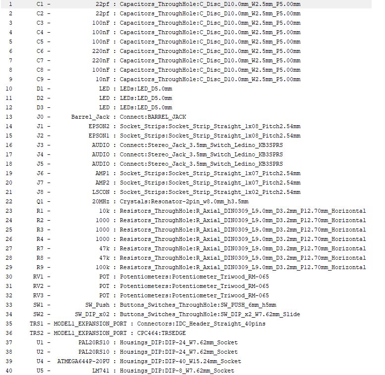

# Talker/80

## A Modern Voice Synthesizer for the TRS-80 Model 1. 

## News 

### Talker/80 is now available!

## Important License Information

Talker/80 uses GPL 3. This code uses the [Epson S1V30120 firmware image]( https://github.com/MikroElektronika/Click_TextToSpeech_S1V30120/blob/master/library/include/text_to_speech_img.h)
from the [TextToSpeech click board library from MikroElektronika released under GPL2.](
https://github.com/MikroElektronika/Click_TextToSpeech_S1V30120) 
By using this code, you are also bound to the [Epson license terms for the S1V30120 firmware.](https://global.epson.com/products_and_drivers/semicon/products/speech/voice/sla/s1v30120_init_data.html)  

## Requirements 

This project was developed using
[WinAVR.](http://winavr.sourceforge.net/) In addition, the [AVR
Programming Libraries](https://github.com/hexagon5un/AVR-Programming)
from Elliot Williams' book "Make: AVR Programming" are being used. 

## Building and Maker Support 

I am able to provide Talker/80 as a kit, or only pre-programmed
components (GALs, Atmega), or even a fully assembled version inlcuding
a connection cable. Send me a mail if you are interrested.

## Introduction

Talker/80 offers: 

  1. **DECtalk-Based Text-to-Speech (TTS) Synthesis:** the **Epson S1V30120 TTS** chip on the utilized mikroBUS "TextToSpeech Click!" daughterboard from MikroElektronika implements DECtalk v5 -- a natural sounding speech synthesizer for English and Spanish, with different voices. DECtalk can even sing. The DECtalk mode is very powerful and versatile, but the DECtalk control language can be difficult to program. Hence, a simplified control language for the S1V30120 is offered as well, the so-called Epson mode. The DECtalk mode is used to implement **emulations of two classic TRS-80 Model 1 Voice Synthesizers**: the official TRS Voice Synthesizer from Tandy Radio Shack, and the VS100 Voice Synthesizer from Alpha Works. Both use the **Votrax SC-01** speech chip, which is emulated by means of DECtalk here. The DECtalk and Epson modes produce superior speech quality, and text-to-speech is performed by Talker/80 itself, i.e., no breaking down into phonemes is required. You can just send the text to be spoken durectly to IO port 11. And the status of the speech synthesizer can be checked by reading from port 11. 

  2. **TRS Voice Synthesizer Emulation**: the emulation in terms of DECtalk as just described is good enough to produce understandable speech, but it sounds different than the Votrax SC-01 chip. Original software such as the TRS Voice Synthesizer BASIC Demo Program, and "Talking Eliza", work without software changes and. The emulation is only 80% faitful or so. A main difference between the emulation and the original is that it is not possible to utter phonemes "in realtime", since DECtalk requires buffering of phonemes first before they can be spoken. Whereas the SC-01 is able to "turn on and off" a phoneme immediately and also use them as "sound effects". This is exploited, for example, in the TRS Voice Synthesizer BASIC Demo Program, which spells out individual phonemes in real time ("the phonemes in the word zero are: z e r o" etc.) Due to the buffering required for DECtalk, this is challenging to get right. Check out my demo videos to see if you can live with the result. Due to the method of IO being used, the TRS Voice Synthesizer (and its Talker/80 emulation) can only be used if connected directly to the Model 1's expansion port! It will not work behind the Expansion Interface. The reason being that Video RAM snooping is used as the IO method, and the RAM READ and WRITE signals are not available at the Expansion Interface expansion port. Note that Talker/80 is equipped with an expansion port passthrough edge connector, so the Expansion Interface can be connected to the Talker/80 *behind* it. 

 3. **VS100 Voice Synthesizer from Alpha Works Emulation**: another classic TRS-80 voice synthesizer. Also used the Votrax SC-01, but was / is not compatible with the TRS Voice Synthesizer. Talker/80 uses the same method of emulation (mapping to DECtalk phonemes). Same comments wrt. buffering etc. apply. Original software works without patches (e.g., VS48 and VS100DEMO.BAS etc.). In addition, pitch control is not supported, so the speech will be monotonous. 

 4. **Cassette Sound Input Port and Audio Mixer**: Talker/80 is equipped with two input stero mini jacks; one for the output from the MikroElektronika speech daughterboard, and one can be connected to the TRS 80 Cassette Output Port (for sound). The signals are being mixed. Two input pots on the right and corresponding trimmers on the left side are used to determine the two signal levels for the mix. The mixed LM741 output signal is available at the output mini jack on the left side. 

 5. **Optional Amplifier and Loudspeaker**: In addition, a little "off the shelf" D-class audio amplifier can be fitted on the PCB. The two input signals (after the pots / trimmers) is being amplified. The output is available to the loudspeaker pin header at the back of the PCB. The output volume is controlled by the trimmer / pot at the top right.  

 6. **Expansion Port Pass Through Connector**: Talker/80 connects directly to the Model 1's expansion port. The expansion port connector is at the back of the PCB. The Expansion Interface (EI) is then connected to Talker/80's expansion port passthrough edge connector. Talker/80 is fully compatible with the EI, Floppy Disks, FreHD, etc. 

 7. **DIP Switch for Initial Mode Selection**: for selecting the intial startup mode of Talker/80. The mode can be changed via software as well (by sending a so-called "control byte"). 

 8. **RESET button**: for reinitializing / "rebooting" Talker/80. In combination with the DIP switch, the mode can be changed easily without having to use software to send control bytes. 

 9. **Three LEDs**: These LEDs are used for mode indiciation, to signal data being received, to indicate when Talker/80 is speaking, and when a single phoneme is being uttered. LEDs will also indicate errors. 

## TRS-80 Model 1 Connection & Startup Sequence 

Talker/80 gets its power from a standard, voltage stabilized **5V power supply** ("Wall Wart") with **positive center polarity**, **5.5 mm x 2.5mm**.  It connects to the Talker/80 Barrel Jack.  

It is very important that your equipment is powered on in the right order of sequence: 

 1. Make sure everything is turned off 
 2. Make sure everything is connected correctly (Talker/80 to the Model 1, Expansion Interface to Talker/80 is present)
 3. Supply power to Talker/80 by plugging in the PSU. You should hear "Talker/80 initialized" and an announcement of the current mode, which depends on the settings of the DIP switches. 
 4. Power on your Floppy Drives, Printer, etc. 
 5. Power on the Expansion Interface. 
 6. Power on the Model 1. 

## Hardware Description

Talker/80 uses an Atmega 644-20 (U4) clocked at 20 Mhz as its microcontroller. The firmware has ~ 45 KBs. The firmware was programmed in C, using the WinAVR / GCC toolchain. At startup, the Atmega loads the Epson firmware image (implementing DECtalk) over SPI into the speech daughterboard. At runtime, SPI is used as well. External interupts are being used to register read and write requests. The address decoding is done by a GAL20V10 (U1), and another GAL20V10 (U2) is acting as a tristate databus latch and also provides status input (bits 6 and 7) to the Model 1 in all modes other than the TRS Voice Synthesizer emulation mode. U5 is the op-amp. 

The current mode of Talker/80 is being signaled to the address decoder GAL U2, using 2 bits for the 4 different modes. Depending on the mode, the GAL U2 eiher decodes IO requests (using IN and OUT signals), or video RAM addresses (and signals RD and WR) to implement "video snooping" as required for the TRS Voice Synthesizer. The details can be found in the GAL code here.

Applications can read from IO port 11 to find out if Talker/80 is actively speaking. Note that input to Talker/80 is always buffered, so realtime control of the speaking process (e.g., "voice synthesizer sound effects") is not achievable. 

### Address Decoding in the Epson and DECtalk Modes  

Talker/80 **listens to port 11**. For the text content, 7 bit ASCII is being used. The text-to-speech conversion is performed internally, so no phoneme encoding on the TRS-80 side is  required. Input from IO port 11 is being buffered. The buffer has a size of 256 bytes. A **return  (CR / ASCII code 13)** initiates the text to speech process, and Talker/80 starts to speak (if the buffer had content). While it speaks, bit 7 of port 11 will be low (i.e., ``? inp(11)`` in BASIC returns 127 while it is speaking, and 255 otherwise). 

ASCII characters being sent to port 11 which have its 8th bit set (i.e., bytes > 127) are being interpreted as **control bytes**. Control bytes are used to control the Talker/80, i.e., to change its current mode, to change parameters of the speech (voice, speak rate, volume), etc. The list of control bytes is given below. For example, to reset Talker/80, send 255 to IO port 11 (use ``out 11,255`` in BASIC).    

Speech can be **blocking or non-blocking**. In the blocking mode, the Model 1's Z80 CPU is suspended by pulling Z80's ``WAIT`` signal low. 

### Address Decoding in the VS100 Mode 

The primary IO port the VS100 is also port 11. And like in the Epson and DECtalk modes, one can read the status from port 11. Bit 7 indicates if it is busy speaking. 

However, partial / lazy address decoding was being used for the VS100 (to reduce decoder complexity and hence chip counts), and so, according to information from members of the Vintage Computer Forum, the following IO ports can also be used to address the VS100  ("it responds if bits 7, 5, 4 and 2 are 0, don't care for others"):

- 0, 1, 2, 3
- 8, 9, 10, **11** 
- 64, 65, 66, 67
- 72, 73, 74, 75

Unlike the DECtalk and EPSON modes, text to speech / encoding of text into phonemes has to be performed on the Model 1 side. SC-01 phonemes are being sent, not ASCII text characters. 

These are the SC-01 phonemes; the VS-100 phonemes are identical: 

Note that, in order to do the text-to-speech / phoneme mapping, the VS100 software driver can be used (the programs ``VS48`` and ``VS32``). These drivers allow text-to-speech from BASIC then, so the driver performs the text to phoneme mapping.   

Talker/80 **does not implement the pitch control feature of the SC-01.** The VS-100 uses the last two bits (Bits 6 and 7) of the phoneme bytes to encode / provide pitch control; i.e., each phoneme has in principle 4 different "pronounciations" or "pitches".  These two pitch bits on phonemes are currently being ignored by Talker/80 and hence not supported. To prevent interference with existing VS100 software, the control bytes understood by Talker/80 in the DECtalk and EPSON modes, are NOT supported in the VS100 mode. 

Since control bytes are not accepted in this mode, all changes to the default settings need to be made BEFORE entering the VS100 mode. For example, if a different voice, speech rate or volume is required in the VS100 mode, then make these changes to the setting from the EPSON or DECtalk mode first, and then enter the VS100 mode from using the corresponding control byte `&EB`. The changed voice synthesizer settings will then carry over to the VS100 mode. The mode can only be exited by using the RESET button. 

Here is a picture of the **original VS-100 Voice Synthesizer:** 

    

### Address Decoding in the TRS Voice Synthesizer Mode

The TRS Voice Synthesizer uses memory-based IO. 
It snoops write to the video RAM in the address range ``$3FE0 .. $3FFF``. Only the temporal order of writes matters, not the actual address from that range.  Hence, in this mode, any write (WR signal) in that address range will put a byte in the buffer. 

A special protocol is being used. Even though the TRS Voice Synthesizer uses the same speech chip as the VS100, the SC-01, it is not using the SC-01 phonemes directly. Rather, Tandy Radio Shack invented a "printed" phoneme character set for some of the SC-01 phonemes. A special character, the "?" opens and closes the "window" to the Voice Synthesizer. 

The TRS Voice Synthesizer's printed ASCII phonemes for some of the SC-01 phonemes are the following: 

Note that, like in the VS100, control bytes are not accepted in this mode, as normal "to screen" printing  might otherwise trigger them. If a different voice setting is required in the TRS Voice Synthesizer mode (e.g., a different voice, speech rate or volume), then the setting must be changed from the EPSON or DECtalk mode first, and then the TRS Voice Synthesizer mode be entered using the control bytes `&ED` or `&EC`. The changed voice synthesizer settings will carry over to the new mode, and be active from now on. Note that the TRS Voice Synthesizer mode can then be exited only by using the RESET button (since no control bytes are accepted). 

Here is a picture of the **original TRS Voice Synthesizer:** 

### Phoneme Tables and Phoneme Mappings  

The VS100 and TRS Voice Synthesizer Emulations work by mapping SC-01 phonemes to DECtalk "close enough equivalents". This produces understandable speech, but the resulting speech sounds different from the original SC-01. 

Talker/80 implements the following mapping from SC-01 phonemes to DECtalk phonemes: 

    void init_allophones(void) {

      // VOTRAX SC01 -> ARPABET (DECTALK) 

      sc01_map[0x00] = "ih"; // EH3 jackEt
      sc01_len[0x00] = 59;

      sc01_map[0x01] = "eh"; // EH2 Enlist   
      sc01_len[0x01] = 71;

      sc01_map[0x02] = "eh"; // EH1 hEAvy  
      sc01_len[0x02] = 121; 

      sc01_map[0x03] = "_";  // PA0 Pause 
      //sc01_map[0x03] = "";  // PA0 Pause 
      sc01_len[0x03] = 47;

      sc01_map[0x04] = "t"; // DT buTTer 
      sc01_len[0x04] = 47;

      sc01_map[0x05] = "ey"; // A2 mAde 
      sc01_len[0x05] = 71;

      sc01_map[0x06] = "ey"; // A1 mAde 
      sc01_len[0x06] = 103; 

      sc01_map[0x07] = "zh"; // ZH aZure
      sc01_len[0x07] = 90;

      sc01_map[0x08] = "aa"; // AH2 hOnest
      sc01_len[0x08] = 71;

      sc01_map[0x09] = "ah"; // I3 inhibIt 
      sc01_len[0x09] = 55;

      sc01_map[0x0a] = "ih"; // I2 Inhibit 
      sc01_len[0x0a] = 80;

      sc01_map[0x0b] = "ih"; // I1 InhIbit 
      sc01_len[0x0b] = 121; 

      sc01_map[0x0c] = "m"; // M Mat
      sc01_len[0x0c] = 103;

      sc01_map[0x0d] = "n"; // N suN
      sc01_len[0x0d] = 80;

      sc01_map[0x0e] = "b"; // B Bag
      sc01_len[0x0e] = 71;

      sc01_map[0x0f] = "v"; // V Van
      sc01_len[0x0f] = 71;

      sc01_map[0x10] = "ch"; // CH* CHip, T must precede CD to produce CH sound 
      sc01_len[0x10] = 71;

      sc01_map[0x11] = "sh"; // SH SHop
      sc01_len[0x11] = 121;

      sc01_map[0x12] = "z"; // Z Zoo 
      sc01_len[0x12] = 71;

      sc01_map[0x13] = "ao"; // AW1 lAWful   
      sc01_len[0x13] = 146;

      sc01_map[0x14] = "nx"; // NG thiNG   // ng ??
      sc01_len[0x14] = 121;

      sc01_map[0x15] = "aa"; // AH1 FAther 
      sc01_len[0x15] = 146;

      sc01_map[0x16] = "uh"; // OO1 lOOking 
      sc01_len[0x16] = 103;

      sc01_map[0x17] = "uh"; // OO bOOk 
      sc01_len[0x17] = 185;

      sc01_map[0x18] = "ll"; // L Land 
      sc01_len[0x18] = 103;

      sc01_map[0x19] = "k"; // K triCK 
      sc01_len[0x19] = 80;

      sc01_map[0x1a] = "jh"; // J Judge, D must precede J to produce J sound 
      sc01_len[0x1a] = 47;

      sc01_map[0x1b] = "hx"; // H Hello  // hh ??
      sc01_len[0x1b] = 71;

      sc01_map[0x1c] = "g"; // G Get
      sc01_len[0x1c] = 71;

      sc01_map[0x1d] = "f"; // F Fast
      sc01_len[0x1d] = 103;

      sc01_map[0x1e] = "d"; // D paiD
      sc01_len[0x1e] = 55;

      sc01_map[0x1f] = "s"; // S paSS 
      sc01_len[0x1f] = 90;

      sc01_map[0x20] = "ey"; // A dAY 
      sc01_len[0x20] = 185;

      sc01_map[0x21] = "ey"; // AY dAY 
      sc01_len[0x21] = 65;

      sc01_map[0x22] = "yx"; // Y1 Yard // y ? 
      sc01_len[0x22] = 80;

      sc01_map[0x23] = "ah"; // UH3 missIOn
      sc01_len[0x23] = 47;

      sc01_map[0x24] = "aa"; // AH mOp 
      sc01_len[0x24] = 250;

      sc01_map[0x25] = "p"; // P Past 
      sc01_len[0x25] = 103;

      sc01_map[0x26] = "ow"; // O cOld  
      sc01_len[0x26] = 185;

      sc01_map[0x27] = "ih"; // I pIn 
      sc01_len[0x27] = 185;

      sc01_map[0x28] = "uw"; // U mOve  
      sc01_len[0x28] = 185;

      sc01_map[0x29] = "iy"; // Y anY   
      sc01_len[0x29] = 103;

      sc01_map[0x2a] = "t"; // T Tap 
      sc01_len[0x2a] = 71;

      sc01_map[0x2b] = "r"; // R Red
      sc01_len[0x2b] = 90;

      sc01_map[0x2c] = "iy"; // E mEEt 
      sc01_len[0x2c] = 185; 

      sc01_map[0x2d] = "w"; // W Win
      sc01_len[0x2d] = 80;

      sc01_map[0x2e] = "ae"; // AE dAd 
      sc01_len[0x2e] = 185;

      sc01_map[0x2f] = "ae"; // AE1 After 
      sc01_len[0x2f] = 103;

      sc01_map[0x30] = "ao"; // AW2 sAlty 
      sc01_len[0x30] = 90;

      sc01_map[0x31] = "ah"; // UH2 About 
      sc01_len[0x31] = 71;

      sc01_map[0x32] = "ah"; // UH1 Uncle 
      sc01_len[0x32] = 103;

      sc01_map[0x33] = "ah"; // UH3 cUp 
      sc01_len[0x33] = 185;

      sc01_map[0x34] = "ao"; // O2 fOr 
      sc01_len[0x34] = 80;

      sc01_map[0x35] = "ao"; // O1 abOArd 
      sc01_len[0x35] = 121;

      sc01_map[0x36] = "yx"; // IU yOU 
      sc01_len[0x36] = 159;

      sc01_map[0x37] = "uw"; // U1 yOU 
      sc01_len[0x37] = 90;

      sc01_map[0x38] = "dh"; // THV THe 
      sc01_len[0x38] = 80;

      sc01_map[0x39] = "th"; // TH THin
      sc01_len[0x39] = 71;

      sc01_map[0x3a] = "er"; // ER bIrd 
      sc01_len[0x3a] = 146;

      sc01_map[0x3b] = "eh"; // EH gEt 
      sc01_len[0x3b] = 185;

      sc01_map[0x3c] = "iy"; // E1 bE 
      sc01_len[0x3c] = 121;

      sc01_map[0x3d] = "ao"; // AW cAll
      sc01_len[0x3d] = 250;

      //sc01_map[0x3e] = "_"; // PA1 = no sound 
      sc01_map[0x3e] = "_"; // PA1 = no sound 
      sc01_len[0x3e] = 185;

      sc01_map[0x3f] = "_"; // STOP = no sound
      sc01_len[0x3f] = 47;

      // RS TRS80 Voice Synthesizer 

	// codes 00 to 31 
	trs_to_sc01_map['@'] = 0x06; // A1
	trs_to_sc01_map['A'] = 0x08; // A2
	trs_to_sc01_map['B'] = 0x0e; // B 
	trs_to_sc01_map['C'] = 0x10; // CH
	trs_to_sc01_map['D'] = 0x1e; // D
	trs_to_sc01_map['E'] = 0x3c; // E1
	trs_to_sc01_map['F'] = 0x1d; // F
	trs_to_sc01_map['G'] = 0x1c; // G
	trs_to_sc01_map['H'] = 0x1b; // H
	trs_to_sc01_map['I'] = 0x0b; // I1
	trs_to_sc01_map['J'] = 0x1a; // J
	trs_to_sc01_map['K'] = 0x19; // K
	trs_to_sc01_map['L'] = 0x18; // L
	trs_to_sc01_map['M'] = 0x0c; // M
	trs_to_sc01_map['N'] = 0x0d; // N
	trs_to_sc01_map['O'] = 0x35; // O1
	trs_to_sc01_map['P'] = 0x25; // P
	trs_to_sc01_map['Q'] = 0x38; // DH 
	trs_to_sc01_map['R'] = 0x2b; // R
	trs_to_sc01_map['S'] = 0x1f; // S
	trs_to_sc01_map['T'] = 0x2a; // T
	trs_to_sc01_map['U'] = 0x37; // U1
	trs_to_sc01_map['V'] = 0x0f; // V 
	trs_to_sc01_map['W'] = 0x2d; // W 
	trs_to_sc01_map['X'] = 0x07; // ZH
	// trs_to_sc01_map['Y'] = 0x22; // Y1
	trs_to_sc01_map['Y'] = 0x29; // Y - corrected by MW
	trs_to_sc01_map['Z'] = 0x12; // Z 
	trs_to_sc01_map['['] = 0x34; // O2
	trs_to_sc01_map['\\'] = 0x26; // O
	trs_to_sc01_map[']'] = 0x31; // AH
	trs_to_sc01_map['^'] = 0x20; // A 
	trs_to_sc01_map['_'] = 0x03; // NULL (PA0?) 

	// codes 32 to 62 (63 = "?" = OPEN/CLOSE WINDOW) 

	trs_to_sc01_map[' '] = 0x3e; // PA1
	trs_to_sc01_map['!'] = 0x0a; // I2
	trs_to_sc01_map['\"'] = 0x27; // I
	trs_to_sc01_map['#'] = 0x09; // I3
	trs_to_sc01_map['$'] = 0x17; // OO
	trs_to_sc01_map['%'] = 0x16; // OO1
	// trs_to_sc01_map['&'] = 0x29; // Y
	trs_to_sc01_map['&'] = 0x22; // Y1 - corrected by MW
	trs_to_sc01_map['\''] = 0x28; // U
	trs_to_sc01_map['('] = 0x36; // IU
	trs_to_sc01_map[')'] = 0x05; // A2
	trs_to_sc01_map['*'] = 0x21; // AY
	trs_to_sc01_map['+'] = 0x14; // NG
	trs_to_sc01_map[','] = 0x3d; // AW

	// ??? : 
	trs_to_sc01_map['-'] = 0x3f; // 0 DEC. ??? GUESSING STOP 

	trs_to_sc01_map['.'] = 0x2c; // E
	trs_to_sc01_map['/'] = 0x3a; // ER
	trs_to_sc01_map['0'] = 0x03; // PA0 
	trs_to_sc01_map['1'] = 0x13; // AW1
	trs_to_sc01_map['2'] = 0x30; // AW2
	trs_to_sc01_map['3'] = 0x02; // EH1
	trs_to_sc01_map['4'] = 0x01; // EH2
	trs_to_sc01_map['5'] = 0x00; // EH3
	trs_to_sc01_map['6'] = 0x32; // UH1
	trs_to_sc01_map['7'] = 0x31; // UH2
	trs_to_sc01_map['8'] = 0x33; // UH3
	trs_to_sc01_map['9'] = 0x2f; // AE1
	trs_to_sc01_map[':'] = 0x2e; // AE
	trs_to_sc01_map[';'] = 0x15; // AH1
	trs_to_sc01_map['<'] = 0x38; // THV
	trs_to_sc01_map['='] = 0x39; // TH
	trs_to_sc01_map['>'] = 0x11; // SH 

    }

### The Talker/80 Printed Circuit Board (PCB) 

The DIP switches are used for initial boot / startup mode selection (note that the mode can be changed later by sending a control byte); for switch 1, 2 from left to right: 

  - **0n 0n**: EPSON Mode. 
  - **0n Off**: TRS Voice Synthesizer Mode. 
  - **Off On**: VS100 Voice Synthesizer Mode. 
  - **Off Off**: DECtalk Mode.     

The LEDs have the following meaning - during startup and after mode selection, they briefly indicate the selected mode. The blink in case of errors. In normal operation, they have the following meaning:    

 - **D1:** Incoming data.  
 - **D2:** On if a single phoneme is being uttered, and when the "stop speech" command is being processed. 
 - **D3:** Actively speaking.  

### Schematics 

 

[Click here for a PDF version of the schematics.](schematics/schematics.pdf) 

### PCB Gerbers 

Talker/80 was made with [KiCad EDA v4.0.7](http://kicad-pcb.org/),
and "freeRouting.jar" did the routing.

 

[Gerbers can be found here.](gerbers/talker80.zip) 

A version is also hosted on the [Seeed Gallery for immediate ordering of PCBs.](https://www.seeedstudio.com/Talker80-3-g-1230571)

### Bill of Material 

 

I recommend the use of standard stackable Arduino Headers for J1 and J2 (instead of soldering the daughter board in permanently). For the amplifier board, J6 and J7 are simple pin headers that make the connection to the amplifier board: 

 

The form factors in the above BOM are **for illustration only.** Instead of ceramic disc capacitors, I have used ceramic multilayer capacitors mostly. I recommend using DIP sockets for all chips. 

## Talker/80 Control Bytes 

Soon. 

    switch ( control_byte ) {

	// 255
      case 0xFF : process_reset(); break; 
	// 254
      case 0xFE : STOP_NOW = SPEAKING_NOW;  break; 
	// 253 
      case 0xFD : disable();  break; 
	// 252
      case 0xFC : blocking_speech();  break; 
	// 251 
      case 0xFB : non_blocking_speech();  break; 

	// 239 
      case 0xEF : native_mode_epson(); break; 
	// 238
      case 0xEE : native_mode_dectalk(); break; 
	// 237 
      case 0xED : trs_mode(); break; 
	// 236 
      case 0xEC : trs_mode_counter_based(); break; 
	// 235 
      case 0xEB : vs100_mode(); break; 
	// 234 
      case 0xEA : confirmations_on(); break;  
	// 233 
      case 0xE9 : confirmations_off(); break;   
	// 232 
      case 0xE8 : english(); break; 
	// 231 
      case 0xE7 : spanish(); break; 
	// 230 
      case 0xE6 : enable_alternate(); break;  
	// 229 
      case 0xE5 : disable_alternate(); break;   
	// 228 
      case 0xE4 : announce_cur_mode(); break; 
	// 227 
      case 0xE3 : speak_copyright_note(); break; 
	// 226 
      case 0xE2 : speak_hal9000_quote(); break; 
	// 225 
      case 0xE1 : sing_daisy(); break; 
	// 224 
      case 0xE0 : speak_version(); break; 

	// 208 - 223 
      case 0xD0 ... 0xDF : set_pitch( control_byte - 0xD0); break; 

	// 192 - 207
      case 0xC0 : set_voice_default(); break;
      case 0xC1 ... 0xCD : set_voice( control_byte - 0xC0); break; 

	// 176 - 191 
      case 0xB0 : set_volume_default(); break;
      case 0xB1 ... 0xBF : set_volume( control_byte - 0xB0); break;

	// 160 - 175 
      case 0xA0 : set_rate_default(); break;
      case 0xA1 ... 0xAF : set_rate( control_byte - 0xA0); break;

    }

## Talker/80 Programming 

Have a look at the BASIC programs. 

## The Talker/80 Firmware 

Here are the firmware files:  

* [GAL22V10 JEDEC Address Decoder](src/gal22v10/Talker80-decoder.jed)
* [GAL22V10 JEDEC Databus Buffer](src/gal22v10/Talker80-databus.jed)
* [ATmega 644 Firmware](src/atmega644/talker80-firmware.hex)

For reference, the WinCUPL files for the [address decoder}(src/gal22v10/Talker80-decoder.PLD),  the 
[databus buffer](src/gal22v10/Talker80-databus.PLD), and the 
[Atmega 644 firmware C-sources](src/atmega644/talker.c) are also provided. 

The Atmega can be programmed with an EPROM programmer such as the inexpensive USB TL866II which can be found on Ebay and/or Amazon for ~
30 USD. The fuse settings required for Talker/80's 20 MHz external clock are shown in the following picture:

 
## Software

There are a couple of demo programs.

The main disk is called [`talker80.hfe`](trs80/images/talker80.hfe) and 
(or [`talker80.jv3`](trs80/images/talker80.jve). The disk loads with LDOS 3.51. 

It contains the following: 

----------------------------------------------------------------
| Program      | Description                                   |
|--------------|-----------------------------------------------|
| SENDBYTE.BAS | Send Reset Command from Z80 MC Program.       |
| SENDBYTE.BAS | Send Reset Command from Z80 MC Program.       |
---------------------------------------------------------------- 

## Media 

### Some Pictures

Final breadboard prototype: 

First PCB version - IDC connector was still on the fron side, and no audio amp yet (only the op-amp mixer): 

Final version of Talker/80 - with ampflifier board fitted and Model 1 connector at the back, and better placement for switches and trimmers / pots: 

 
 

### Some YouTube Videos of Talker/80 in Action

- [First Breadboard Prototype](https://youtu.be/NUp0_M16cys?list=PLvdXKcHrGqhcJzzogLMI-J4Or-ap6UVSY)
- [First PCB Version](https://youtu.be/BFiDv-7CvXA?list=PLvdXKcHrGqhcJzzogLMI-J4Or-ap6UVSY) 
- [Towards the TRS Voice Synthesizer Emulation](https://youtu.be/rNow4joSyGI?list=PLvdXKcHrGqhcJzzogLMI-J4Or-ap6UVSY) 
- [VS100 Emulation and More Complete Demo of Features ](https://youtu.be/aMnv22EwFEc?list=PLvdXKcHrGqhcJzzogLMI-J4Or-ap6UVSY) 
- ["Talking Eliza" with Talker/80](https://youtu.be/Vv27CSFUAi0?list=PLvdXKcHrGqhcJzzogLMI-J4Or-ap6UVSY)

## Maker Support 

The Gerbers and Firmware and all specs (BOM, ...) are all open source and in principle you can build one yourself. However, if you require certain parts or a pre-programmed GALs, the Atmega, or even a fully assembled Talker/80, please contact me. 

## Acknowledgements

Thanks to [Teodor Costachioiuo](https://electronza.com/about-me/) for
the [Talking Clock Tutorial with the Mikroelektronika Text to Speech
Clock Board](https://electronza.com/wp-content/uploads/2017/09/talking_clock-1.zip);
I have rewritten this (Arduino) code and ported it to WinAVR.

Elliot Wiliams for his book "Make: AVR Programming" and [corresponding sources /AVR Programming Libraries.](https://github.com/hexagon5un/AVR-Programming).

Special thanks to member of the "Vintage Computer Forum" (especially to "Joe Zwerko"!) for providing crucial info, such as the phoneme tables for the Votrax SC-01 and the TRS Voice Synthesizer. 

## Disclaimer 

Use at your own risk. I am not responsible for any potential damage you might cause to your Model 1, other machinery, or yourself, in the process of assembling and using this piece of hardware.

**Enjoy!** 

